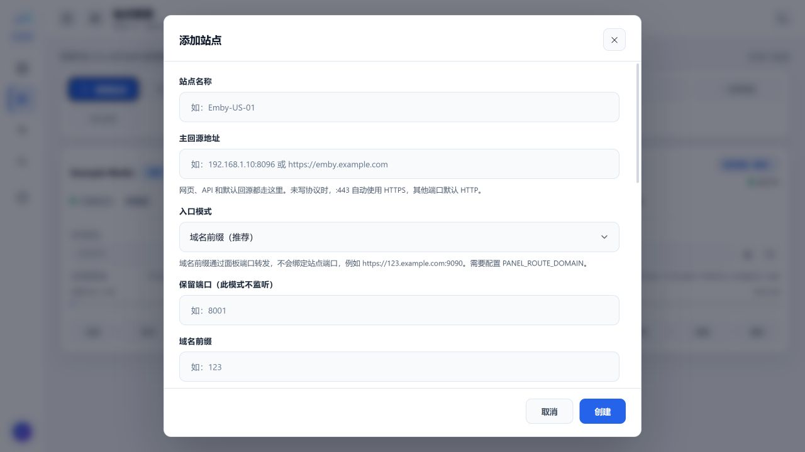

# Meridian

Meridian 是一个面向 Emby 多站点场景的 Go 反向代理管理面板。它把站点配置、动态播放地址发现、TLS 入口、流量统计、请求日志、缓存和运行诊断集中在一个服务中管理。


## 特点

- 多站点独立配置：主回源、入口模式、UA、流量额度、限速和缓存均按站点隔离。
- 自动播放反代：整合 `emby-reverse-proxy-go` 的播放地址识别方案，
  自动改写 PlaybackInfo、HLS、DASH 和 HTTP 30x 中的后端地址。
- 域名前缀入口：通过一个独立 HTTPS 端口和泛域名把不同前缀路由到不同站点，不依赖 `443`。
- 透明客户端身份：新站点默认透传 User-Agent、Client 和 Version。
- TLS 证书管理：面板内通过 Cloudflare DNS-01 申请证书，证书和 ACME 数据保存在数据目录。
- 实时观测：仪表盘显示累计缓存和站点状态，流量页支持最近 1/6/24 小时及 7 天的分钟级聚合。
- 请求日志：按站点、资源类型、状态码、客户端 IP、UA 和路径筛选，视频流单独分类，支持 SSE 实时更新。
- 静态资源缓存：自动排除视频、音频、HLS、DASH 和 Range 响应，并按节点容量淘汰最旧文件。
- 单管理员认证：HttpOnly 会话 Cookie、bcrypt 密码、初始化令牌和状态变更同源校验。
- 单个 Go 进程：前端嵌入二进制，站点代理生命周期、优雅退出和 SQLite 持久化统一管理。

## 界面预览

截图使用白色主题、本地演示数据和 `example.com` 示例域名，不包含生产环境地址或凭据。

### 仪表盘


### 站点管理


### 流量统计


### 日志记录


### 故障诊断


## 域名前缀与独立端口

该模式让 Meridian 在一个独立端口（默认 `9090`）上同时提供面板和节点入口。
请求通过 Host 识别：面板域名进入管理面板，节点前缀进入对应站点，
因此不需要占用通常已被其他业务使用的 `443`。

```text
面板： https://panel.example.com:9090
节点： https://123.example.com:9090
       └── 123 是站点管理中填写的域名前缀
```

### 配置步骤

1. DNS 添加 `panel.example.com` 和 `*.example.com`，都指向 Meridian 服务器。
2. 设置 `PANEL_ROUTE_DOMAIN=example.com` 和 `PANEL_DOMAIN=panel.example.com`。
3. 在面板的 TLS 页面使用 Cloudflare DNS-01 申请覆盖面板域名和泛域名的证书。
4. 在站点管理中选择“域名前缀”，填写 `123` 等前缀并保存。
5. 证书签发后启用 `PANEL_TLS_ENABLED=true`，再重启容器或 systemd 服务。



### 使用注意

- `PANEL_ROUTE_DOMAIN` 只填写基础域名，不要填写协议、端口或 `*`。
- 泛域名证书申请需要可写数据目录；Docker 必须保留 `/app/data` 卷，Linux 安装必须保留 `/opt/meridian`。
- `9090` 是 HTTPS 端口，客户端地址必须带 `https://` 和 `:9090`。
- 反向代理必须透传原始 Host；未配置的前缀会被拒绝，前缀必须唯一。
- Cloudflare 橙云的标准代理端口不包含 `9090`。请使用 DNS-only、
  Cloudflare Tunnel，或把外部受支持的 HTTPS 端口转发到 Meridian。

## TLS 证书申请

打开“站点管理 → TLS 证书”，填写 ACME 邮箱和 DNS API Token。Token 仅用于当前进程的 DNS-01 申请，不写入数据库、证书文件或日志。


证书默认保存到：

```text
<数据目录>/tls/fullchain.pem
<数据目录>/tls/privkey.pem
```

申请成功后设置 `PANEL_TLS_ENABLED=true` 并重启服务。首次启动必须保持 `false`；证书文件尚未生成时启用 TLS 会导致面板无法启动。

## 自动播放反代

Meridian 已整合
[Gsy-allen/emby-reverse-proxy-go](https://github.com/Gsy-allen/emby-reverse-proxy-go)
的播放地址识别方案。新增站点默认开启自动反代，不需要手工选择发现来源或
调整安全策略。

程序会自动识别并改写 PlaybackInfo、HLS、DASH 和 HTTP 30x 中的播放地址。
发现到的公网后端会转换为当前站点的动态代理路由；即使真实后端发生切换，
客户端仍通过本站点入口播放，不会直接暴露或绕过 Meridian。

自动识别不会放宽基础网络安全边界。`localhost`、私网、链路本地和回环目标
始终拒绝，无法通过站点配置或更宽松的发现行为绕过。新站点的 User-Agent
默认透传，并允许真实公网播放地址从 HTTPS 降级到 HTTP。

## Linux 安装

安装脚本从本项目 GitHub Releases 下载对应架构二进制，校验 `SHA256SUMS` 后创建 systemd 服务。

```bash
curl -fsSL \
  https://raw.githubusercontent.com/chanhui800/Meridian/main/install.sh \
  -o /tmp/meridian-install.sh

bash /tmp/meridian-install.sh install
```

无域名安装：

```bash
bash /tmp/meridian-install.sh install --no-domain -y
```

指定面板域名：

```bash
bash /tmp/meridian-install.sh install \
  --domain panel.example.com \
  --email admin@example.com \
  -y
```

默认路径：

| 内容 | 路径 |
| --- | --- |
| 二进制 | `/usr/local/bin/meridian` |
| 环境文件 | `/opt/meridian/.env` |
| 数据库 | `/opt/meridian/meridian.db` |
| systemd 服务 | `/etc/systemd/system/meridian.service` |

常用命令：

```bash
systemctl status meridian
journalctl -u meridian -n 100 --no-pager
bash /tmp/meridian-install.sh update -y
bash /tmp/meridian-install.sh password
```

## Docker Compose 安装

安装 Docker 与 Compose 插件后创建工作目录。下面的命令会生成四个互不相同的随机密钥，并把 `.env` 权限限制为仅当前用户可读写：

```bash
mkdir -p /opt/meridian
cd /opt/meridian
umask 077

cat > .env <<EOF
JWT_SECRET=$(openssl rand -hex 32)
UPSTREAM_HEADER_KEY=$(openssl rand -hex 32)
DYNAMIC_ROUTE_KEY=$(openssl rand -hex 32)
SETUP_TOKEN=$(openssl rand -hex 32)
PANEL_ROUTE_DOMAIN=
PANEL_DOMAIN=
PANEL_TLS_ENABLED=false
EOF
```

首次初始化管理员时需要 `.env` 中的 `SETUP_TOKEN`。管理员创建成功后，该令牌不再用于登录。

`compose.yaml`：

```yaml
services:
  meridian:
    image: ghcr.io/chanhui800/meridian:v1.8.11
    container_name: meridian
    restart: unless-stopped
    read_only: true
    cap_drop: [ALL]
    security_opt:
      - no-new-privileges:true
    tmpfs:
      - /tmp:rw,noexec,nosuid,size=16m
    ports:
      - "9090:9090"
      - "8001-8010:8001-8010"
    volumes:
      - meridian-data:/app/data
    env_file:
      - .env

volumes:
  meridian-data:
```

启动：

```bash
docker compose pull
docker compose up -d --force-recreate
docker compose ps
docker compose logs --tail=100 meridian
```

不使用域名时，通过 `http://服务器IP:9090` 打开面板。
独立端口站点默认示例范围为 `8001-8010`，请按实际站点端口调整 Compose 的 `ports`。

`/app/data` 必须可写，用于 SQLite、缓存、TLS 证书和 ACME 账户密钥。
升级时不要删除 `meridian-data` 卷。升级固定版本时修改 `image` 标签，
然后再次执行上面的三条 Docker Compose 命令。

要启用域名前缀入口，先在 `.env` 填写以下值并重建容器：

```env
PANEL_ROUTE_DOMAIN=example.com
PANEL_DOMAIN=panel.example.com
PANEL_TLS_ENABLED=false
```

此时先通过 `http://panel.example.com:9090` 登录，在 TLS 证书页面完成签发；
然后把 `PANEL_TLS_ENABLED` 改为 `true`，执行
`docker compose up -d --force-recreate`。之后面板和节点均使用 HTTPS 地址。

## 配置项

| 环境变量 | 默认值 | 说明 |
| --- | --- | --- |
| `PORT` | `9090` | 面板和共享入口监听端口 |
| `DB_PATH` | `meridian.db` | SQLite 数据库路径 |
| `PANEL_BIND_ADDR` | `0.0.0.0` | 监听地址 |
| `PANEL_DOMAIN` | 空 | 面板允许的公共域名 |
| `PANEL_ROUTE_DOMAIN` | 空 | 域名前缀入口的基础域名 |
| `PANEL_TLS_ENABLED` | `false` | 是否让监听端口直接提供 HTTPS |
| `PANEL_TLS_CERT_FILE` | 数据目录 `tls/fullchain.pem` | 外部证书链 PEM 路径 |
| `PANEL_TLS_KEY_FILE` | 数据目录 `tls/privkey.pem` | 外部私钥 PEM 路径 |
| `JWT_SECRET` | 启动时生成 | 会话签名密钥，生产环境必须固定 |
| `UPSTREAM_HEADER_KEY` | 空 | 上游固定请求头加密密钥 |
| `DYNAMIC_ROUTE_KEY` | 空 | 动态播放 capability 密钥 |
| `SETUP_TOKEN` | 空 | 首次创建管理员的令牌 |
| `TRUSTED_PROXY_CIDRS` | 空 | 可信反向代理 CIDR |
| `ASSET_CACHE_DIR` | 数据目录 `asset-cache` | 静态缓存根目录 |

## 缓存规则

缓存按节点隔离，容量上限是单节点上限。每次写入后超过上限会淘汰最旧使用的缓存文件。

```text
*/file/*
*/emby/Items/*/Images/*
```

命中规则后仍会检查扩展名和 Content-Type。视频、音频、HLS、DASH、Range、私有响应和带 `Set-Cookie` 的响应不会写入缓存。

## 数据、备份与安全

- SQLite 保存管理员、站点、流量、请求日志和动态观测数据。
- `JWT_SECRET`、`UPSTREAM_HEADER_KEY`、`DYNAMIC_ROUTE_KEY` 必须使用不同随机值。
- 不要把 `.env`、TLS 私钥、ACME 账户密钥或数据库提交到 Git。
- 更新前备份 Docker 数据卷或 `/opt/meridian` 数据目录。
- 只有 `TRUSTED_PROXY_CIDRS` 中的代理才可以提供客户端 IP 和协议头。

Docker 数据备份示例：

```bash
docker run --rm \
  -v meridian_meridian-data:/data:ro \
  -v "$PWD":/backup \
  alpine:3.24 \
  tar czf /backup/meridian-data-$(date +%Y%m%d-%H%M%S).tar.gz -C /data .
```

## API 与构建

```text
GET  /api/auth/check
POST /api/auth/setup
POST /api/auth/login
POST /api/auth/logout
GET  /api/dashboard
GET  /api/sites
GET  /api/traffic/{siteID}
GET  /api/request-logs
GET  /api/ingress-capabilities
GET  /api/dynamic-profiles
GET  /api/ua-profiles
GET  /api/events
```

```bash
go test ./...
go vet ./...
go build -trimpath -buildvcs=false -o meridian .
docker build --build-arg VERSION=dev -t meridian:dev .
```

正式版本使用无后缀标签，例如 `v1.8.11`。Release 工作流会执行测试、
前端检查、Shell 检查、漏洞扫描和安全检查，然后发布多平台二进制与
Linux amd64/arm64 GHCR 镜像。

## License

[MIT License](LICENSE)
