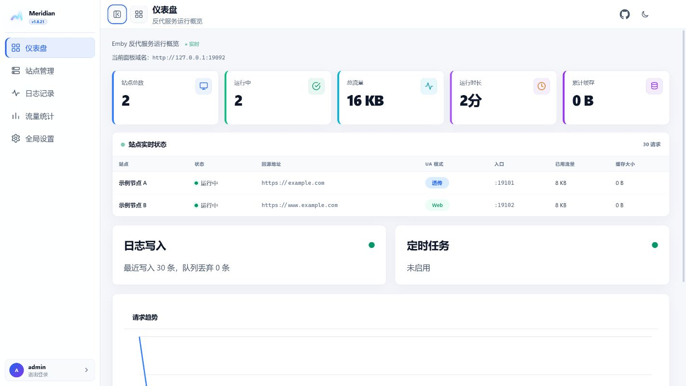
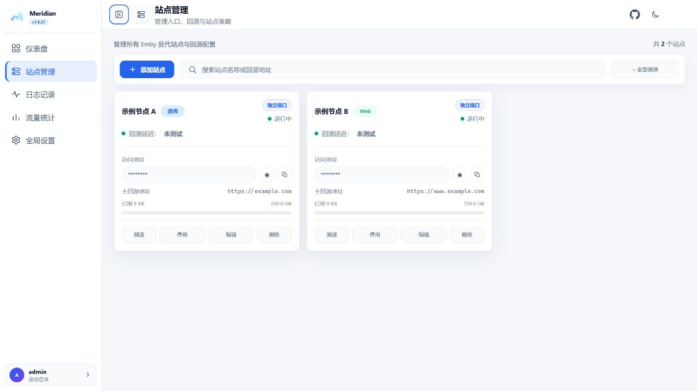
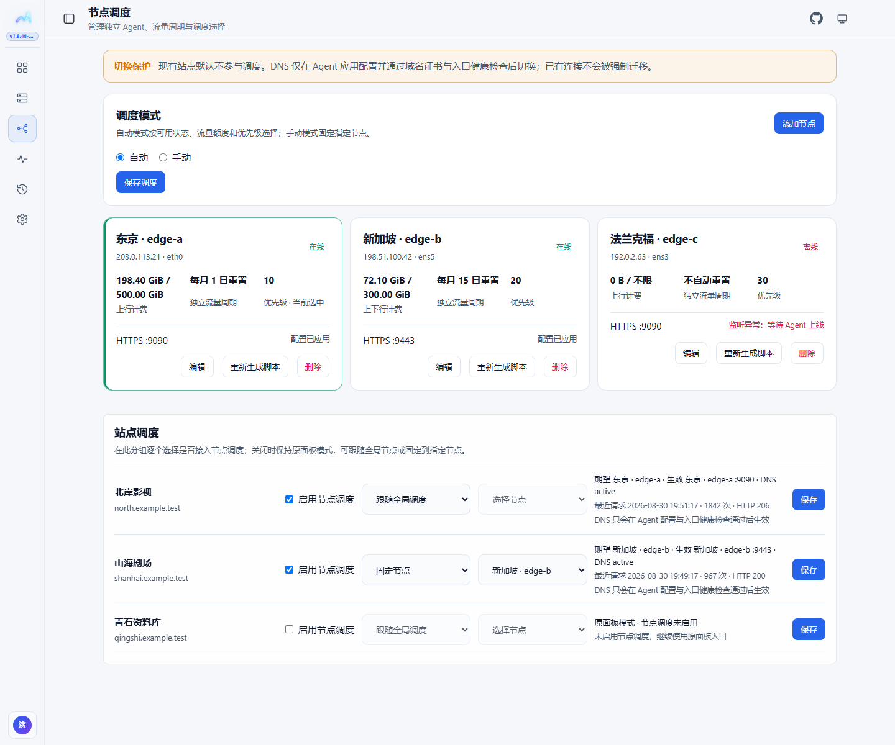
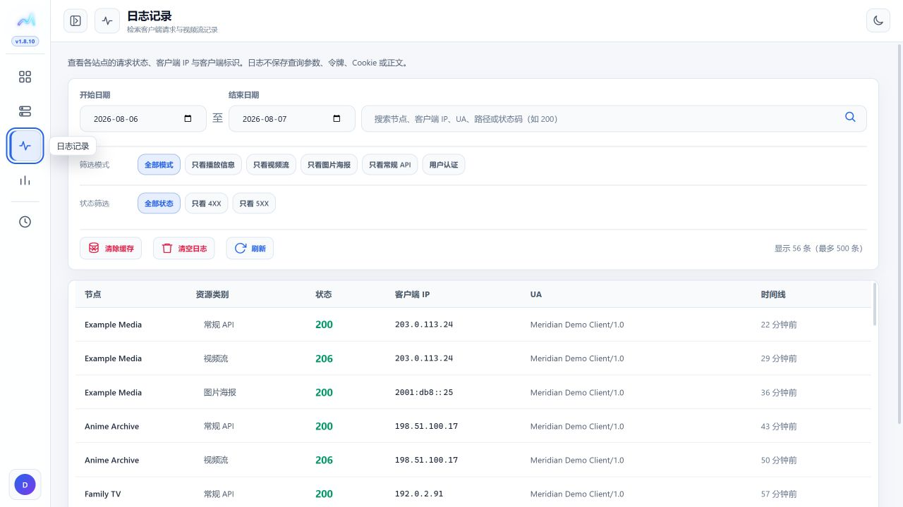
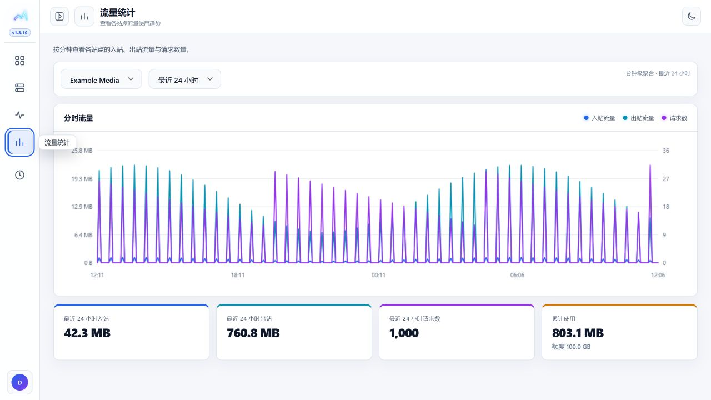
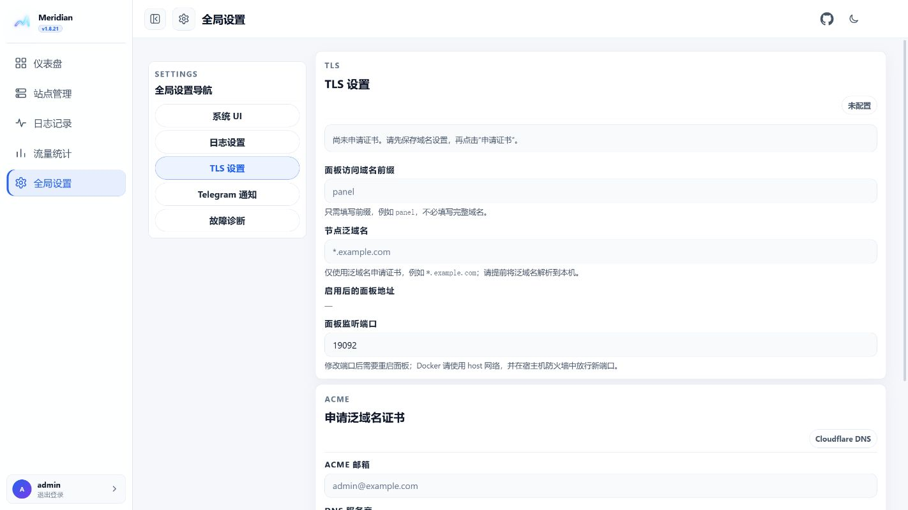
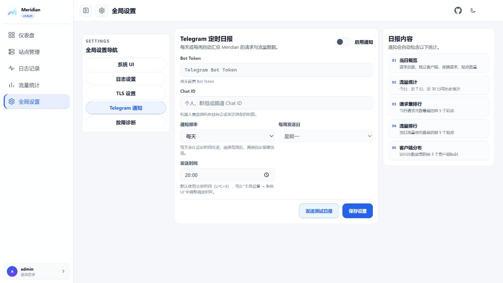

# Meridian

[](https://github.com/chanhui800/Meridian/actions/workflows/ci.yml)
[](https://github.com/chanhui800/Meridian/releases/latest)
[](LICENSE)

Meridian 是 Emby / Jellyfin 的多站点反向代理面板。它负责入口、线路故障转移、播放地址改写、流量统计、请求日志、观看历史、TLS 和可选的分布式节点调度。

## 功能

- 多站点、多上游线路，支持主线路和备用线路自动切换。
- 独立端口、路径前缀、域名前缀三种入口方式。
- PlaybackInfo、HLS、DASH、HTTP 重定向和 WebSocket 地址改写。
- 主视频流反代或合法公网 30x 直连。
- 按站点记录请求、最终后端、客户端信息、收发字节和趋势。
- 可选观看历史、媒体库数量、保号提醒、TMDB 补全和 Telegram 日报。
- ACME 泛域名证书、自动续签、加密备份与恢复。
- 可选节点调度：一台主控管理多台 Agent，DNS 只切换新连接。

## 界面预览

以下截图来自当前前端，使用演示数据，不包含生产环境域名、IP 或令牌。

| 仪表盘 | 站点管理 |
| --- | --- |
|  |  |
| 节点调度 | 请求日志 |
|  |  |
| 观看历史 | 流量统计 |
|  |  |
| TLS 设置 | Telegram 日报 |
|  |  |

## 快速安装

### Docker

```yaml
services:
  meridian:
    image: ghcr.io/chanhui800/meridian:latest
    container_name: meridian
    restart: unless-stopped
    network_mode: host
    volumes:
      - ./data:/app/data
    environment:
      PORT: "9090"
      DB_PATH: /app/data/meridian.db
```

```bash
mkdir -p data
docker compose up -d
docker compose logs meridian
```

首次启动时日志会输出一次管理员初始化令牌。打开 `http://服务器地址:9090` 完成初始化。数据库、证书和缓存位于 `./data`，更新容器不会删除它们。`network_mode: host` 使面板和站点端口直接占用宿主机端口，请先确认端口和防火墙规则。

### Linux 原生安装

交互安装：

```bash
curl -fsSL https://raw.githubusercontent.com/chanhui800/Meridian/main/install.sh | sudo bash
```

无交互安装：

```bash
curl -fsSL https://raw.githubusercontent.com/chanhui800/Meridian/main/install.sh | sudo bash -s -- install -y --no-domain
```

默认数据库为 `/var/lib/meridian/meridian.db`。服务名是 `meridian`：

```bash
sudo systemctl status meridian --no-pager
sudo journalctl -u meridian -f
```

安装器会按 CPU 架构下载 GitHub Release 二进制并校验 SHA-256。升级时重新运行安装器，数据库、证书和缓存会保留。

## 站点配置

新增站点时填写名称、入口和上游线路。入口可以选择：

| 方式 | 示例 |
| --- | --- |
| 独立端口 | `http://panel.example.com:9001` |
| 路径前缀 | `https://panel.example.com:9090/movie` |
| 域名前缀 | `https://movie.example.com:9090` |

一个站点可配置一条主线路和最多七条备用线路。请求无法连接主线路时按顺序尝试备用线路，主线路恢复后新请求自动切回。普通 API、HLS/DASH、字幕、图片和 WebSocket 默认反代；主视频流选择“直连”时，仅在上游返回合法公网 30x 后交给客户端连接 CDN。

域名前缀入口需要在“全局设置 → TLS 设置”配置面板域名、泛域名和 Cloudflare DNS API Token。证书由 ACME 申请和续签，Token 加密保存在数据库中。

## 节点调度

节点调度是可选模块。主控保存节点、站点分配、优先级、流量周期和 DNS 状态；每台 VPS 只运行一个 `meridian-agent`，不需要安装完整面板。详细步骤见：[节点调度](docs/node-scheduling.md) 和 [Agent 安装与卸载](docs/agent-installation.md)。

### 添加 Agent

在“节点调度”中创建节点，复制页面一次性显示的安装命令，在目标 VPS 执行。命令从当前主控的 `/api/agent/install.sh` 获取与该版本绑定的通用安装器，安装器再从同一主控下载并校验 Agent；注册成功后将短期注册令牌替换为长期凭据，并创建 `meridian-agent.service`。独立二进制安装的主控也会同时安装 `/usr/local/bin/meridian-agent`，因此 `/api/agent/binary` 不依赖 Docker 专用路径；升级主控时 Agent 会一并更新，失败会成对回滚。Agent 会自动选择默认路由网卡，每 15 秒上报心跳、累计收发字节、配置版本和监听错误。

Agent 安装脚本只应从你自己的主控地址获取，例如：

```bash
curl -fsSL https://panel.example.com:9090/api/agent/install.sh | sudo bash -s -- \
  --controller https://panel.example.com:9090 \
  --token '<一次性注册令牌>'
```

令牌只用于注册，不要提交到 GitHub、聊天记录或公开日志。卸载命令：

```bash
sudo systemctl disable --now meridian-agent.service
sudo rm -f /etc/systemd/system/meridian-agent.service
sudo rm -rf /opt/meridian-agent /var/lib/meridian-agent /etc/meridian-agent
sudo systemctl daemon-reload
```

### 分配和切换

站点默认不参与节点调度。在同一页面为站点启用调度并选择：

- 自动：只在节点启用、在线且未达到流量额度时参与；按调度优先级从高到低排序，优先级相同时选择当前周期已用流量较少的节点。节点配置应用后才会进行 HTTPS/SNI 健康检查。
- 手动：从可用节点中指定固定节点；节点离线或额度不足时不会悄悄改用其他节点。
- 关闭：继续使用站点原有主控反代链路。

节点端只配置一个 HTTPS 端口。创建时默认使用主控端口，保存后可独立修改；主控改端口不会覆盖节点设置。多个站点可以共用一个节点端口，通过 TLS SNI 和 HTTP Host 区分。端口必须未被 Xray、Nginx、Caddy 或其他服务占用；若 443 已被占用，可使用 9090 等空闲端口。

启用调度后，控制器把站点 Host 路由和边缘专用证书配置下发到 Agent，并使用节点 IP 发起带 SNI/Host 的 HTTPS 健康检查。检查成功后才创建或更新 Cloudflare 精确 A/AAAA 记录。停用或删除调度时只删除 Meridian 自己保存的 DNS 记录 ID，不触碰用户手动创建的同名记录。DNS 只影响新连接，已建立的播放连接不会迁移。

Docker 主控在已配置 Cloudflare ACME 凭据后，可执行 `docker exec meridian /app/meridian admin issue-edge-certificate` 为已注册且启用的节点签发独立于面板私钥的 Edge 证书。每张证书包含路由泛域名和节点唯一 SAN，避免所有节点消耗同一 ACME 标识符集合；节点注册后会立即尝试签发，定时任务只负责续签和补偿。证书缺失时 Agent 配置会保持等待并在调度页面显示最后一次错误。

节点上报的网卡累计流量是额度统计的依据；按站点上报的收发字节和趋势只用于日志、排查和展示。流量周期可在节点编辑中选择每月重置日，已用流量也可以手动校正。

## 日志和观看历史

请求日志可按资源类别、状态、站点和最终节点筛选。日志字段包括客户端 IP/UA、上游 UA、最终后端、收发字节和时间线。站点开启“观看历史记录”后，成功的播放状态同步才会生成记录；节点调度不会改变站点级日志和历史归属。

## TLS、备份和环境变量

面板可直接监听 HTTPS 端口，也可放在已有反向代理后面。使用 80/443 前请确认没有其他进程占用。备份页面可生成带密码的 `.mrbak` 文件；TLS 设置和证书默认不包含，迁移域名时再显式勾选。

常用环境变量：

| 变量 | 默认值 | 说明 |
| --- | --- | --- |
| `PANEL_BIND_ADDR` | `0.0.0.0` | 面板监听地址 |
| `PORT` | `9090` | 面板端口 |
| `DB_PATH` | `meridian.db` | SQLite 路径 |
| `JWT_SECRET` | 自动生成 | 登录和敏感配置加密密钥 |
| `UPSTREAM_HEADER_KEY` | 自动生成 | 上游请求头密钥 |
| `DYNAMIC_ROUTE_KEY` | 自动生成 | 动态路由密钥 |
| `TRUSTED_PROXY_CIDRS` | 空 | 可信前置代理网段 |
| `ASSET_CACHE_DIR` | 数据库目录下 `asset-cache` | 图片缓存目录 |

## 发布和开发

最新正式版和校验文件见 [GitHub Releases](https://github.com/chanhui800/Meridian/releases)。容器镜像为 `ghcr.io/chanhui800/meridian:latest`，固定版本可使用 `ghcr.io/chanhui800/meridian:v1.9.4`。

本地检查：

```bash
go test ./...
go vet ./...
npm test
```

项目许可证见 [LICENSE](LICENSE)。
