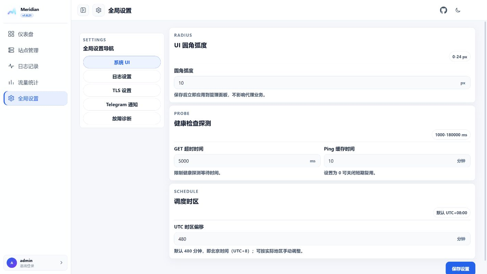

# Meridian

[](https://github.com/chanhui800/Meridian/actions/workflows/ci.yml)
[](https://github.com/chanhui800/Meridian/actions/workflows/codeql.yml)
[](https://github.com/chanhui800/Meridian/releases/latest)
[](LICENSE)

Meridian 是面向 Emby、Jellyfin 等媒体服务的多节点反向代理面板。本仓库基于 [snnabb/Meridian](https://github.com/snnabb/Meridian) 修改，并参考 [CF-EMBY-PROXY-UI](https://github.com/axuitomo/CF-EMBY-PROXY-UI) 优化界面与交互。

当前版本：`v1.8.32`

## 主要功能

- 多节点管理，支持独立端口和域名前缀入口。
- 自动发现并改写 PlaybackInfo、HLS、DASH 和 HTTP 30x 播放地址。
- 主视频流可选“反代”或“直连”，默认反代；网盘服 30x 可校验后交给客户端直连。
- 支持 TLS 泛域名证书、静态资源缓存、流量统计和运行诊断。
- 请求日志可筛选资源类别，并分别记录客户端 UA、上游 UA 和最终后端地址。
- Telegram 每日或每周定时日报，默认使用北京时间，可自定义调度时区。
- 白色/黑色主题、响应式侧栏和移动端日志布局。
- Docker 与 Linux systemd 均支持健康检查、优雅停止和自动重启。

HTTP `499` 表示客户端主动取消请求，不等同于 Meridian 或上游产生的 `502`。

## 界面预览

截图使用本地白色主题演示数据，不包含生产环境信息。

| 仪表盘 | 站点管理 |
| --- | --- |
|  |  |
| 请求日志 | 流量统计 |
|  |  |
| 全局设置 | Telegram 日报 |
|  |  |

## Docker 部署

```yaml
services:
  meridian:
    image: ghcr.io/chanhui800/meridian:latest
    container_name: meridian
    restart: unless-stopped
    network_mode: host
    volumes:
      - ./data:/app/data
    environment:
      PORT: "9090"
      DB_PATH: /app/data/meridian.db
```

```bash
mkdir -p data
docker compose up -d
docker compose logs -f meridian
```

首次启动会自动生成并持久化登录、上游请求头、动态路由和初始化所需的随机密钥，无需手动创建。查看容器日志获取首次管理员初始化令牌，然后访问 `http://服务器地址:9090`。

Linux Docker 使用 `network_mode: host`，面板和节点端口会直接监听宿主机，请在防火墙中放行相应端口。数据保存在 `./data`，升级容器不会清除数据库、证书和缓存。

## Linux 原生安装

安装脚本会下载当前正式版对应架构的二进制并校验 SHA-256：

```bash
curl -fsSL https://raw.githubusercontent.com/chanhui800/Meridian/main/install.sh | sudo bash
sudo systemctl status meridian
```

默认数据库为 `/var/lib/meridian/meridian.db`，服务由 `systemd` 管理。日志可通过以下命令查看：

```bash
sudo journalctl -u meridian -f
```

## 站点与播放策略

新增站点后自动发现默认开启，不需要配置安全模式、发现来源或播放回源列表。Meridian 会自动识别播放后端，同时拒绝 localhost、回环、私网、链路本地及其他保留目标。

- **反代**：主视频流继续经过 Meridian，适合统一入口和隐藏后端。
- **直连**：MP4、MKV、MOV、AVI、WebM 及 `/Videos/.../stream`、`/original`、`/download`、`/file` 等主视频请求会先访问主站；若上游返回合法公网 30x，客户端将直连最终 CDN。普通 API、HLS/DASH、字幕、图片和静态资源仍由 Meridian 反代。

媒体认证头默认完全透传。客户端 UA 默认透传，也可按站点改为预设或自定义 UA。

## 域名前缀与 TLS

域名前缀入口使用“节点前缀 + 泛域名 + 面板端口”，例如：

```text
https://movie.example.com:9090
```

1. 将 `panel.example.com` 和 `*.example.com` 解析到服务器。
2. 先通过 HTTP 登录，在“全局设置 → TLS 设置”中填写面板前缀、泛域名和监听端口。
3. 填写 ACME 邮箱、DNS 服务商及 API Token 后申请证书。
4. 证书签发后启用 HTTPS 并重启。
5. 在站点管理中选择“域名前缀”，为各节点填写唯一域名。

DNS API Token 仅用于当前证书申请，不会保存到数据库或日志。修改监听端口或启用 TLS 会短暂中断连接。

## 日志与通知

日志设置分为三组：

- **资源类别写入**：决定哪些后续请求进入日志；图片海报和媒体元数据默认不写入。
- **日志字段写入**：决定后续新日志是否保存节点、资源类别、状态、客户端 IP、客户端 UA、上游 UA、后端地址和时间线。
- **日志字段展示**：只控制日志表格列，不改写历史数据。

Telegram 日报支持每天或每周发送请求量、流量、排行和客户端分布。Bot Token 加密存储，发送时间按“系统 UI”中的调度时区执行。

## 常用环境变量

| 变量 | 默认值 | 说明 |
| --- | --- | --- |
| `PANEL_BIND_ADDR` | `0.0.0.0` | 面板监听地址 |
| `PORT` | `9090` | 首次初始化监听端口 |
| `DB_PATH` | `meridian.db` | SQLite 数据库路径 |
| `JWT_SECRET` | 自动生成 | 登录会话签名密钥 |
| `UPSTREAM_HEADER_KEY` | 自动生成 | 固定上游请求头加密密钥 |
| `DYNAMIC_ROUTE_KEY` | 自动生成 | 动态路由加密密钥 |
| `SETUP_TOKEN` | 自动生成 | 首次管理员初始化令牌 |
| `TRUSTED_PROXY_CIDRS` | 空 | 可被采纳转发 IP 头的可信代理 CIDR |
| `ASSET_CACHE_DIR` | 数据库目录下 `asset-cache` | 静态资源缓存目录 |

只有来自 `TRUSTED_PROXY_CIDRS` 的代理，其 `X-Real-IP` 和 `X-Forwarded-For` 才会被信任。直连公网部署无需额外配置；使用 OpenResty、Cloudflare 或其他前置代理时再按实际网段填写。

## 更新与开发

Docker 更新：

```bash
docker compose pull
docker compose up -d --force-recreate
```

升级前请备份数据目录。数据库迁移会在启动时自动完成。

本地检查：

```bash
go test ./...
go vet ./...
git diff --check
```

安全策略见 [SECURITY.md](SECURITY.md)，贡献说明见 [CONTRIBUTING.md](CONTRIBUTING.md)。本项目沿用仓库中的 [LICENSE](LICENSE)。
