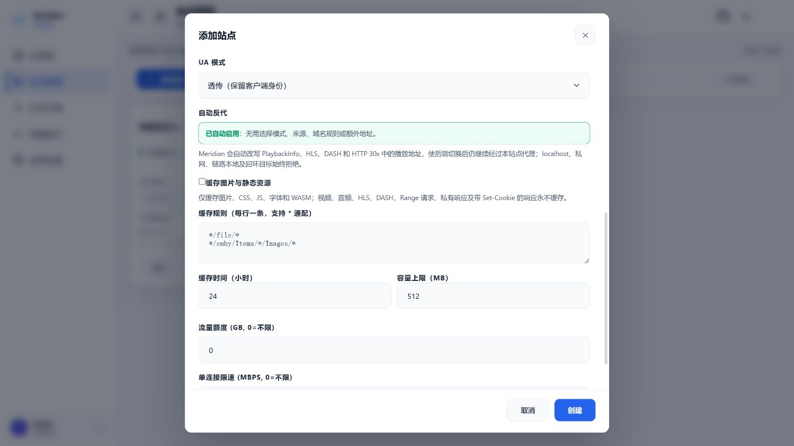
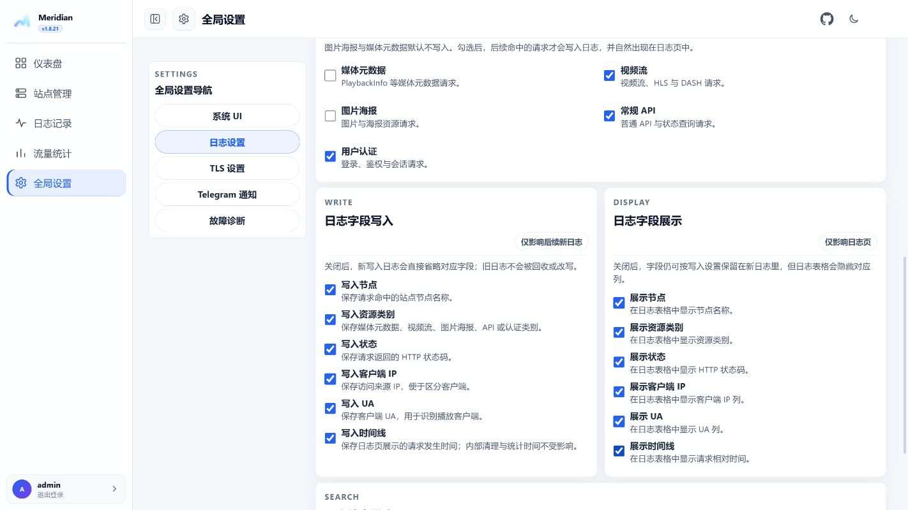
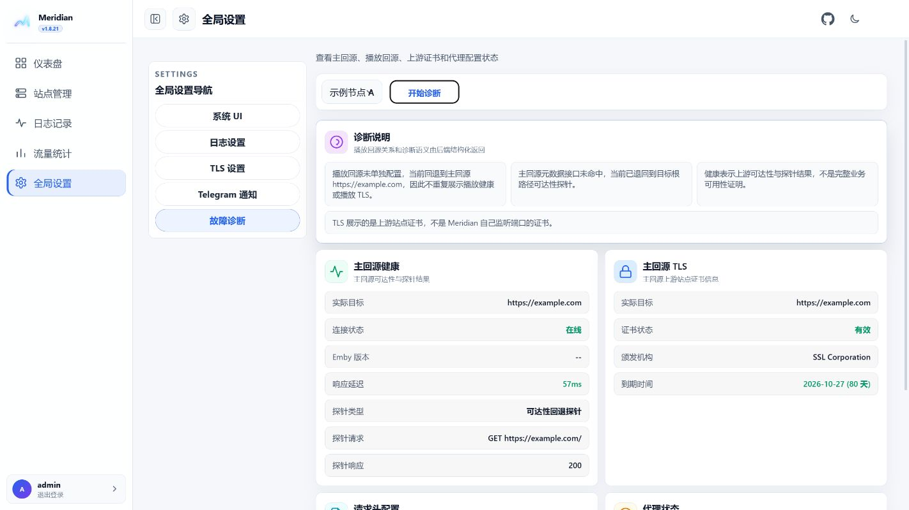

# Meridian（基于原项目的修改版）

[](https://github.com/chanhui800/Meridian/actions/workflows/ci.yml)
[](https://github.com/chanhui800/Meridian/actions/workflows/codeql.yml)
[](https://github.com/chanhui800/Meridian/releases/latest)
[](LICENSE)

本仓库是基于原项目 [snnabb/Meridian](https://github.com/snnabb/Meridian) 的修改版，保留原项目的核心反向代理能力，并针对实际部署补充和调整了域名前缀入口、自动后端改写、TLS 面板配置、缓存、日志和 UI。当前修改版仓库地址为 [chanhui800/Meridian](https://github.com/chanhui800/Meridian)。
UI界面参考CF面板项目[axuitomo/CF-EMBY-PROXY-UI](https://github.com/axuitomo/CF-EMBY-PROXY-UI)

Meridian 是面向 Emby 及兼容媒体服务的反向代理面板。它把多个上游站点统一到一个管理界面，提供独立端口、域名前缀入口、动态后端发现、播放地址改写、TLS、流量统计、请求日志和静态资源缓存。

当前正式版本：`v1.8.31`

本版本完成核心代码按职责拆分，并在请求日志中分别记录客户端 UA 与实际发往后端的上游 UA。主视频流策略保持稳定：默认反代，选择直连时仅将符合主视频路径规则的媒体流交给客户端直连。

快速导航：[Docker 部署](#docker) · [Linux 原生安装](#linux-原生-systemd) · [TLS 与域名前缀](#域名前缀入口与-tls) · [日志设置](#全局设置与日志) · [安全策略](SECURITY.md) · [贡献指南](CONTRIBUTING.md)

客户端在切换页面、刷新列表或取消未完成的图片/媒体请求时，日志会记录为 HTTP `499`（客户端已关闭请求），不再误计为 Meridian 生成的 `502`。真实的上游 502 仍会按 502 记录。

## 界面预览

以下截图均来自本地白色主题演示环境，站点、域名、账号和请求数据均为公开示例，不包含生产配置。

### 仪表盘


### 站点管理


### 添加站点与主视频流策略



### 流量统计


### 请求日志


### 系统 UI 与调度设置


### 日志设置



### Telegram 定时日报


### TLS 设置


### 故障诊断



## 主要特点

- 面板管理多个节点：新增、编辑、启停、延迟测试和运行诊断。
- 两种入口：独立端口，或 `节点前缀.泛域名:面板端口` 的域名前缀入口。
- 新增站点时自动启用后端发现与反代，无需选择安全模式、发现来源、域名规则或额外播放回源。
- 自动识别并改写 PlaybackInfo、HLS、DASH 和 HTTP 30x 中的播放地址，使后端切换后仍经过当前站点代理；默认允许 HTTPS → HTTP 回源降级。
- 对 localhost、回环、私网、链路本地和其他特殊目标执行拒绝，防止动态发现绕过目标安全边界。
- 媒体认证头默认完全透传；UA 默认透传，可按站点覆盖。
- 请求日志分别显示客户端传入的原始 UA 与 Meridian 实际发往后端的上游 UA；透传模式下两者相同，自定义或预设 UA 模式下可用于直接确认改写结果。搜索同时支持两种 UA。
- 请求日志支持按日期、真实资源类别、状态、节点、客户端 IP、客户端/上游 UA、后端地址、路径和状态码检索；筛选区直接平铺播放信息、播放状态同步、主视频流、播放清单、媒体分片、图片海报、媒体元数据、字幕、静态资源、WebSocket、常规 API 和用户认证，不再提供聚合视频流或高级分类。
- 日志设置可分别控制播放信息、视频流、图片海报、媒体元数据、字幕、静态资源、WebSocket、常规 API 与用户认证的写入，以及节点、资源类别、状态、客户端 IP、客户端 UA、上游 UA、后端地址、时间线八个字段的写入与展示；图片海报和媒体元数据默认不写入。
- 核心 Go 代码已按数据库、站点、代理、动态发现、日志和面板等职责拆分，运行方式和配置保持不变。
- Telegram 定时日报支持每天或每周发送，可配置发送时间、星期和目标会话；默认使用北京时间，可在系统 UI 中调整调度时区。
- 全局设置统一管理系统 UI、日志、TLS、Telegram 通知和故障诊断，设置页采用紧凑卡片布局并支持缓存数据即时呈现。
- 面板支持白色/黑色主题、桌面折叠导航和移动端可收起侧栏，右上角可直接进入本项目 GitHub 仓库。
- 每个节点独立配置缓存上限，按真实目标路径匹配并按最旧使用时间淘汰；视频流、音频流、HLS/DASH 清单和分片不会写入静态缓存。
- TLS 页面直接申请泛域名证书，证书申请后可在页面点击“启用 HTTPS 并重启”。
- 仪表盘实时显示当前完整面板访问地址、日志写入状态和定时任务状态。
- Docker 和 Linux systemd 均支持健康检查、优雅停止和自动重启。

## 快速开始

### Docker

```yaml
services:
  meridian:
    image: ghcr.io/chanhui800/meridian:latest
    container_name: meridian
    restart: unless-stopped
    # Linux Docker 使用宿主机网络，面板设置的监听端口直接绑定宿主机
    network_mode: host
    volumes:
      - ./data:/app/data
    environment:
      PORT: "9090"
      DB_PATH: /app/data/meridian.db
```

```bash
mkdir -p data
docker compose up -d
docker compose logs -f meridian
```

首次启动时，容器会自动生成互不相同的 `JWT_SECRET`、`UPSTREAM_HEADER_KEY`、`DYNAMIC_ROUTE_KEY` 和 `SETUP_TOKEN`，并以 `0600` 权限持久化到数据卷内的 `/app/data/.meridian-secrets`；重启会继续复用，不需要用户手动生成。运行 `docker compose logs meridian` 查看首次管理员初始化令牌，再打开 `http://服务器地址:9090` 完成管理员初始化。若有高级部署需求，仍可通过同名环境变量显式覆盖自动值。

入口脚本会把固定的 `/app/data` 数据目录权限收敛给容器内 UID `10001`，因此新建的宿主机绑定目录无需手动执行 `chown`。之后在 TLS 页面修改监听端口并重启，容器会直接在宿主机的新端口监听。`network_mode: host` 适用于 Linux Docker；它不使用 `ports` 映射，需在宿主机防火墙中放行所选端口。

### Linux 原生 systemd

安装脚本会从 GitHub Releases 下载对应架构的二进制并校验 `SHA256SUMS`：

```bash
curl -fsSL https://raw.githubusercontent.com/chanhui800/Meridian/main/install.sh | sudo bash
sudo systemctl status meridian
sudo journalctl -u meridian -f
```

原生安装默认使用 `/var/lib/meridian/meridian.db`，服务文件位于 `/etc/systemd/system/meridian.service`。首次启动后访问 `http://服务器地址:9090`。

## 域名前缀入口与 TLS

域名前缀方案不要求单独占用 443 端口。面板监听 9090 时，节点地址可以是：

```text
https://movie.example.com:9090
```

其中 `movie` 是节点前缀，`*.example.com` 是节点泛域名。面板本身使用单独的子域名前缀，例如 `panel.example.com:9090`。

### 配置步骤

1. 在 DNS 中将 `panel.example.com` 和 `*.example.com` 解析到 Meridian 服务器。
2. 先用 HTTP 登录面板，进入“TLS 证书”。
3. 填写“面板访问域名前缀”（只填 `panel`）、“节点泛域名”（填写 `*.example.com`）和面板监听端口（默认 `9090`）。面板完整域名会自动拼接为 `panel.example.com`。
4. 点击“保存设置”。保存前缀不会申请证书；修改监听端口会记录为待重启。
5. 首次申请或泛域名发生变化时，填写 ACME 邮箱、DNS 服务商和 DNS API Token，点击“申请证书”。面板前缀变化不会触发证书申请。
6. 证书签发成功或监听端口改变后，点击 TLS 页面中的重启按钮。重启会短暂中断面板和节点连接，Docker/systemd 会自动拉起新进程。
7. 在站点管理中将入口模式设为“域名前缀”，为每个站点填写唯一的公开域名，例如 `movie.example.com`。

ACME 证书订单只申请 `*.example.com` 泛域名，不会重复提交 `panel.example.com`；泛域名证书可同时覆盖面板和一层节点域名。面板完整域名由“面板访问域名前缀”与泛域名自动拼接。域名和 TLS 状态保存在数据库中，后续不需要再修改 `.env`。旧版本环境中的 `PANEL_DOMAIN`、`PANEL_ROUTE_DOMAIN`、`PANEL_TLS_ENABLED` 只会在数据库尚未配置时导入一次，之后以面板设置为准。

注意事项：

- 泛域名 DNS 必须指向同一台 Meridian；Cloudflare 代理状态和防火墙规则应允许 9090 端口。
- DNS API Token 只用于当前申请，不保存到数据库、证书文件或日志。
- 修改泛域名会自动迁移已有的单层节点前缀；域名冲突会在保存前拒绝。
- 证书申请需要服务器能够访问 ACME 和 DNS 服务；测试环境证书不应投入生产。

## 站点、自动发现与主视频流策略

站点可以使用独立端口或域名前缀入口。自动发现默认开启，不需要手动配置发现类型、安全模式、域名规则或播放回源列表。主视频流策略默认选择“反代”，旧站点升级后也保持反代。

使用“域名前缀”模式时共享面板监听端口，无需填写独立端口；留空时由后端自动分配仅用于数据库兼容的内部端口，不会建立独立监听。“独立端口”和“兼容”模式仍需填写有效端口。

Meridian 会从 PlaybackInfo、HLS、DASH 和 HTTP 30x 响应中识别播放后端，并把播放地址重新指向当前 Meridian 入口。内部仍保留严格的目标校验、DNS 固定和动态能力边界；localhost、回环、私网、链路本地及其他保留目标不会因为自动识别而被放行。

选择“直连”后，MP4、MKV、MOV、AVI、WebM 等主视频文件，以及 Emby / Jellyfin 的 `/Videos/.../stream`、`/original`、`/download`、`/file` 等厚媒体请求会先访问主站并只读取响应头。网盘服或 CDN 上游返回 HTTP `301`、`302`、`307`、`308` 时，Meridian 会校验第一层公网目标，再通过 HTTP `307` 将主视频直接交给播放器；主站直接返回媒体正文或探测失败时会回退到原主站直连地址，不会让大流量视频体经过 Meridian。非法、私网、回环或其他受限跳转仍会拒绝。面板、普通 API、PlaybackInfo、WebSocket、HLS / DASH 清单与分片、字幕、图片和必要前端静态资源继续走 Meridian 反代。

认证头采用完全透传：`Authorization`、`X-Emby-Authorization` 和 `X-MediaBrowser-Authorization` 不会被面板改写。`X-Real-IP` 和 `X-Forwarded-For` 按可信代理配置生成或透传；只有明确配置的可信代理才会被采纳为前级身份来源。

## 缓存

“缓存大小上限（MB）”是单节点上限。每次写入后，如果节点缓存总量超过上限，会删除最旧使用的缓存文件直到回到上限以内。

缓存规则按真实目标路径匹配，也支持在前面加域名限制。默认规则：

```text
*/file/*
*/emby/Items/*/Images/*
```

程序还会检查扩展名和 Content-Type。m3u8、mpd、ts、m4s、mp4、mkv、webm、音频文件、`video/*`、`audio/*`、HLS/DASH 类型等不会写入静态缓存。

## 全局设置与日志

“全局设置”固定显示系统 UI、日志设置、TLS 设置、Telegram 通知和故障诊断五个入口。系统 UI 可调整圆角、健康探测超时、Ping 缓存和调度时区；调度时区默认是北京时间 `UTC+08:00`，也可按分钟手动调整。

日志设置分为三层：

- 资源类别写入：控制播放信息与状态同步、视频流、图片海报、媒体元数据、字幕、静态资源、WebSocket、常规 API 和用户认证是否进入后续新日志。PlaybackInfo 归入播放信息；Sessions/Playing、Progress、Stopped、Ping 独立显示为播放状态同步；Items、Shows、Movies、Users 才归入媒体元数据。
- 日志字段写入：控制节点、资源类别、状态、客户端 IP、客户端 UA、上游 UA、后端地址和时间线是否保存在后续新日志中，旧日志不会被改写。
- 日志字段展示：只控制日志表格列是否显示，不影响已经允许写入的字段。

上游 UA 表示 Meridian 最终发送给 Emby 或 Jellyfin 后端的 UA；旧版本已存在的日志不会补写该字段。日志页不会保存查询参数、令牌、Cookie 或请求正文。客户端 IP 只会信任 `TRUSTED_PROXY_CIDRS` 中明确配置的前级代理；未配置可信代理时不会采纳外部伪造的转发头。

## Telegram 定时日报

Telegram 通知可按每天或每周发送，包含当日请求概览、今日/近 7 日/近 30 日及历史累计流量、请求量排行、流量排行和客户端分布。Bot Token 加密保存在数据库中，页面会保持输入框可见；Chat ID、频率、星期和发送时间均可在面板配置。

## 环境变量

大多数用户只需设置数据库、端口和 JWT 密钥；域名和 TLS 在面板配置。

| 变量 | 默认值 | 说明 |
| --- | --- | --- |
| `PANEL_BIND_ADDR` | `0.0.0.0` | 监听地址 |
| `PORT` | `9090` | 首次初始化时的默认面板监听端口；之后以 TLS 页面设置为准 |
| `DB_PATH` | `meridian.db` | SQLite 数据库路径 |
| `JWT_SECRET` | Docker 自动生成；原生安装器自动生成 | 登录会话签名密钥，至少 32 字节 |
| `UPSTREAM_HEADER_KEY` | Docker 自动生成；原生安装器自动生成 | 固定上游请求头加密密钥，至少 32 字节且不得与其他密钥相同 |
| `DYNAMIC_ROUTE_KEY` | Docker 自动生成；原生安装器自动生成 | 自动发现动态路由密钥，至少 32 字节且不得与其他密钥相同 |
| `SETUP_TOKEN` | Docker 自动生成；原生安装器自动生成 | 首次创建管理员使用的初始化令牌；已有管理员后自动忽略 |
| `TRUSTED_PROXY_CIDRS` | 空 | 允许读取前级转发身份的 CIDR 列表 |
| `ASSET_CACHE_DIR` | 数据库目录下 `asset-cache` | 静态缓存目录 |
| `CLIENT_IP_REGION_ENDPOINT` | `https://ipwho.is/{ip}?lang=zh-CN` | 公网客户端 IP 地区查询地址；每个 IP 在内存中缓存 24 小时，设置为 `off` 可关闭 |
| `PANEL_TLS_CERT_FILE` | 数据目录 `tls/fullchain.pem` | 可选的外部证书链路径 |
| `PANEL_TLS_KEY_FILE` | 数据目录 `tls/privkey.pem` | 可选的外部私钥路径 |

旧环境变量 `PANEL_DOMAIN`、`PANEL_ROUTE_DOMAIN`、`PANEL_TLS_ENABLED` 仅用于首次导入，不建议新部署继续依赖它们。

## 更新与回滚

正式发布使用无后缀版本标签，例如：

```bash
docker compose pull
docker compose up -d --force-recreate
```

原生 systemd 更新：

```bash
sudo systemctl stop meridian
# 下载并校验目标版本二进制后替换 /usr/local/bin/meridian
sudo systemctl start meridian
```

升级前请备份数据库和 `data/tls` 目录。数据库迁移在启动时自动执行；如果健康检查失败，应先查看容器日志或 `journalctl -u meridian`，确认数据目录权限和证书文件是否完整。

## 开发与测试

```bash
go test ./...
go vet ./...
git diff --check
```

Windows 上个别依赖端口占用时序的动态启动测试可能受操作系统调度影响；Linux Runner 是发布验证环境。

## 许可证

本项目沿用仓库中的许可证文件，详见 [LICENSE](LICENSE)。
